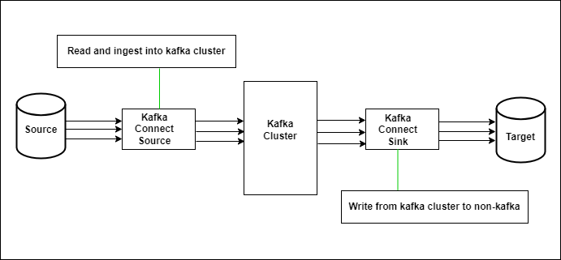
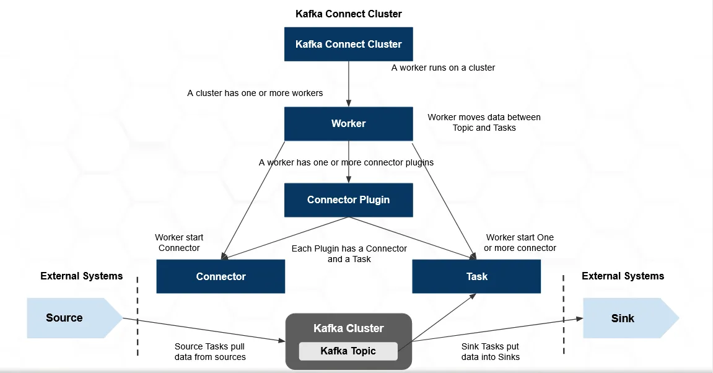

## Kafka Connect:
Kafka Connect is a framework in the Apache Kafka ecosystem designed for scalable and reliable streaming data integration between Kafka (databases, file systems, key-value stores, search indexes, and many more) and other data systems or storage platforms. It allows you to easily build and deploy connectors that handle the movement of data into or out of Kafka.

It works in the two method i.e.

- Import from any external system (called Source) like mysql, hdfs, etc to Kafka broker cluster
- Export from Kafka cluster to any external system (called Sink) like hdfs, s3, etc


Connectors are plugins that define how data should be moved between Kafka and other systems. There are two types of connectors:

- Source connectors: These ingest data from external systems into Kafka topics.
- Sink connectors: These export data from Kafka topics into external systems.





**Kafka Connect features include:**

- A framework for connecting external systems with Kafka – it simplifies the development, deployment, and management of connectors
- Distributed and standalone modes – it helps us to deploy large clusters by leveraging the distributed nature of Kafka, as well as setups for development, testing, and small production deployments
- REST interface – we can manage connectors using a REST API
- Automatic offset management – Kafka Connect helps us to handle the offset commit process, which saves us the trouble of implementing this error-prone part of connector development manually
- Distributed and scalable by default – Kafka Connect uses the existing group management protocol; we can add more workers to scale up a Kafka Connect cluster
- Streaming and batch integration – Kafka Connect is an ideal solution for bridging streaming and batch data systems in connection with Kafka’s existing capabilities
- Transformations – these enable us to make simple and lightweight modifications to individual messages


There are two modes of Operations:

- Standalone mode: Useful for development and testing Kafka Connect on a local machine. It can also be used for environments that typically use single agents (for example, sending web server logs to Kafka).

- Distributed mode: Distributed mode is recommended for production environments because of scalability, high availability, and management benefits. It runs Connect workers on multiple machines (nodes), which form a Connect cluster. Kafka Connect distributes running connectors across the cluster. You can add or remove nodes as your needs evolve.


**Major Components:**
Here are the key components:
- Connector: is a job that manages and coordinates the tasks. It decides how to split the data-coping work between the tasks.
- Task: is piece of work that provide services to accomplish actual job. 
- Worker: is the node that is running the connector and its tasks.


### Kafka Connect Architecture:

- A cluster has one or more Workers 
- A Workers has one or more Connector plugins
- Each plugin has a Connector and a Task 





### Worker Configuration:
For the other parameters, we can leave the default values:

- bootstrap.servers - contains the addresses of the Kafka brokers
- key.converter and value.converter - define converter classes, which serialize and deserialize the data as it flows from the source into Kafka and then from Kafka to the sink
- key.converter.schemas.enable and value.converter.schemas.enable - are converter-specific settings
- offset.storage.file.filename - is the most important setting when running Connect in standalone mode: it defines where Connect should store its offset data
- offset.flush.interval.ms - defines the interval at which the worker tries to commit offsets for tasks


Here's a sample configuration file (connect-standalone.properties) for running Kafka Connect in standalone mode:

```
vim /opt/kafka/config/connect-standalone.properties


# Bootstrap servers (comma-separated list of host:port pairs) for Kafka brokers:
#bootstrap.servers=localhost:9092
bootstrap.servers=192.168.0.8:9092

key.converter=org.apache.kafka.connect.json.JsonConverter
value.converter=org.apache.kafka.connect.json.JsonConverter

key.converter.schemas.enable=false
value.converter.schemas.enable=false

offset.storage.file.filename=/tmp/connect.offsets
offset.flush.interval.ms=10000

# plugin.path=/usr/local/share/java,/usr/local/share/kafka/plugins,/opt/connectors,
plugin.path=/opt/kafka/libs


save and exit
```


### Source Connector Configuration:

Most configurations are connector dependent, so they can't be outlined here. However, there are a few common options:

- name - Unique name for the connector. Attempting to register again with the same name will fail and its user-specified.
- connector.class - The Java class for the connector, basically the kind of connector
- tasks.max - The maximum number of tasks that should be created for this connector. The connector may create fewer tasks if it cannot achieve this level of parallelism.
- topic - defines the topic to which the connector should send the output
- file - defines the file from which the connector should read the input
- key.converter - (optional) Override the default key converter set by the worker.
- value.converter - (optional) Override the default value converter set by the worker.


For the source connector, the configuration at file-source.properties like: 

```
ll /opt/kafka/libs/connect-file-3.7.0.jar
```


```
cat /home/test.txt
foo
bar
```


```
vim /opt/kafka/config/file-source.properties

name=local-file-source
connector.class=FileStreamSource
tasks.max=1
topic=file-source-test
file=/home/test.txt


save and exit
```


### Sink Connector Configuration:
For sink connector, we’ll use the configuration at file-sink.properties like:

```
vim /opt/kafka/config/file-sink.properties

name=local-file-sink
connector.class=FileStreamSink
tasks.max=1
topics=file-source-test
file=/home/test.sink.txt


save and exit
```


### Start Kafka Connect in Standalone Mode:

```
./bin/connect-standalone.sh config/connect-standalone.properties config/file-source.properties config/file-sink.properties
```


We can inspect the content of the topic "file-source-test" using the command line:

```
./bin/kafka-console-consumer.sh --bootstrap-server  192.168.10.190:9092 --from-beginning --topic file-source-test
```


And, we have a look at the folder (/home), we can see that a file test.sink.txt was created here:

```
cat /home/test.sink.txt
foo
bar
```


### References:

- [Kafka Connect](https://kafka.apache.org/documentation/#connect)
- [Confluent Kafka Connect](https://docs.confluent.io/platform/current/connect/index.html)