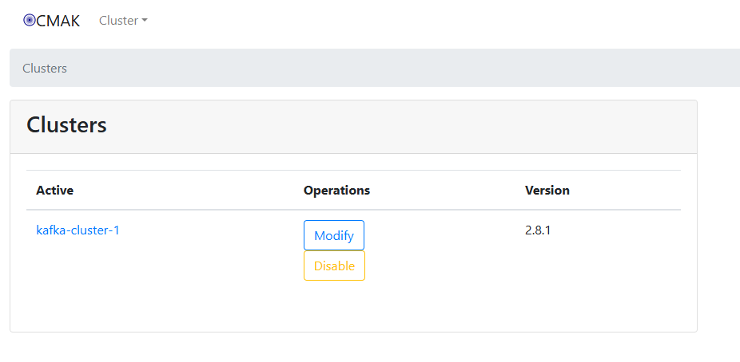

## Kafka Manager: 


### Prerequisite:
- Kafka Broker
- JMX_PORT require for kafka manager
- Java-11 require for kafka manager


### Java Install: 
Kafka Manager requires Java to run. Open a terminal and install Java (OpenJDK 11 is commonly used):

```
yum install java-11-openjdk -y

Or,

yum install java-11-openjdk-devel -y
```


```
java -version

openjdk version "11.0.23" 2024-04-16 LTS
OpenJDK Runtime Environment (Red_Hat-11.0.23.0.9-2.el7_9) (build 11.0.23+9-LTS)
OpenJDK 64-Bit Server VM (Red_Hat-11.0.23.0.9-2.el7_9) (build 11.0.23+9-LTS, mixed mode, sharing)
```


### RUN Zookeeper and Kafka:


_Run Zookeeper:_
```
./bin/zookeeper-server-start.sh config/zookeeper.properties
```


_Run Kafka with `JMX_PORT`:_
```
// ./bin/kafka-server-start.sh config/server.properties

Or,

JMX_PORT=12346 ./bin/kafka-server-start.sh config/server.properties
```


```
netstat -tlpn | grep 12346
```


### Install Kafka Manager:

Kafka Manager is available on GitHub. Follow these steps to download and configure it.


```
git clone https://github.com/yahoo/CMAK.git
```


```
cd CMAK
```


```
./sbt -h
```


```
./sbt clean dist
```


```
### Output:

Downloading sbt launcher for 1.3.8:
  From  https://repo.scala-sbt.org/scalasbt/maven-releases/org/scala-sbt/sbt-launch/1.3.8/sbt-launch-1.3.8.jar
    To  /root/.sbt/launchers/1.3.8/sbt-launch.jar
Downloading sbt launcher 1.3.8 md5 hash:
  From  https://repo.scala-sbt.org/scalasbt/maven-releases/org/scala-sbt/sbt-launch/1.3.8/sbt-launch-1.3.8.jar.md5
    To  /root/.sbt/launchers/1.3.8/sbt-launch.jar.md5
/root/.sbt/launchers/1.3.8/sbt-launch.jar: OK
[info] [launcher] getting org.scala-sbt sbt 1.3.8  (this may take some time)...

```


```
cd target/universal
```


```
unzip cmak-3.0.0.7.zip

cd cmak-3.0.0.7
```


#### Configure Kafka Manager:
Add your Kafka cluster information by editing the configuration. Set the `cmak.zkhosts` variable to your ZooKeeper IP and ports:

_Add the zookeeper IP and Port:_
```
vim conf/application.conf

#cmak.zkhosts="kafka-manager-zookeeper:2181"
cmak.zkhosts="192.168.10.192:2181"
```


_Start Kafka Manager:_

```
./bin/cmak -Dconfig.file=conf/application.conf

Or,

./bin/cmak -Dconfig.file=conf/application.conf -Dhttp.port=8090
```


### Kafka GUI Console:

Kafka Manager should now be running on `http://your_ip:9000` or `http://your_ip:8090`


- Click `Cluster` -> click `Add Cluster`: 
  - Cluster Name: kafka-cluster-1
  - Cluster Zookeeper Hosts: 192.168.10.192:2181
  - Kafka Version: 2.8.1
  - [✓] Enable JMX Polling (Set JMX_PORT env variable before starting kafka server)
  - [✓] Poll consumer information (Not recommended for large # of consumers if ZK is used for offsets tracking on older Kafka versions) 

- Click `Save`


  

  

  

  


